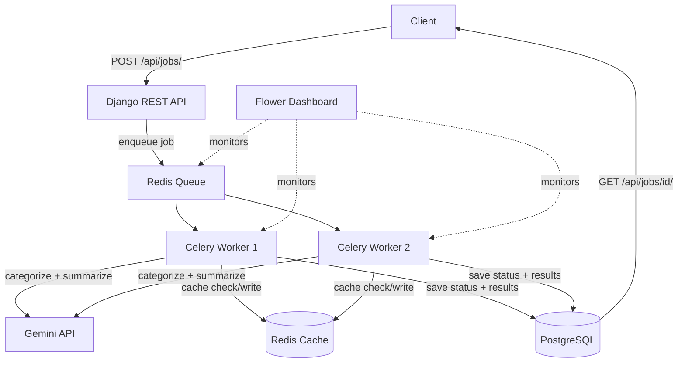

<div align="center">

# AI-Powered Feedback Processing System

**A distributed, asynchronous backend that turns raw customer feedback into categorized, actionable insight — with real fault tolerance, not just a happy path.**


**Status:** Complete · **Last Updated:** September 2026

</div>

---

## Table of Contents

- [Quick Start](#quick-start)
- [Overview](#overview)
- [Features](#features)
- [Architecture](#architecture)
- [Tech Stack](#tech-stack)
- [Project Structure](#project-structure)
- [Setup](#setup)
- [User Workflow](#user-workflow)
- [API Reference](#api-reference)
- [Database Schema](#database-schema)
- [Security](#security)
- [Design Decisions](#design-decisions)
- [Troubleshooting](#troubleshooting)
- [Roadmap](#roadmap)
- [License](#license)

## Quick Start

```bash
git clone https://github.com/<your-username>/<your-repo-name>.git
cd <your-repo-name>
# create a .env file (see Setup below), then:
docker-compose up --build
```

| Service | URL |
|---|---|
| API + browsable UI | http://127.0.0.1:8000/api/jobs/ |
| Flower monitoring dashboard | http://127.0.0.1:5555 |

## Overview

Manually reading through thousands of rows of customer feedback doesn't scale — and blocking an API request while an LLM call runs doesn't either. This project solves both: it's a **distributed task-processing system** that accepts bulk feedback uploads, queues the work, and processes it asynchronously across a pool of Celery workers, each calling a Gemini LLM to categorize and summarize feedback in the background.

Built to demonstrate real backend and distributed-systems fundamentals — async processing, message queues, retries, caching, and container orchestration — rather than another CRUD app.

## Features

**Processing**
- Non-blocking ingestion — upload a CSV, get an instant job ID; all real work happens in the background
- LLM-powered categorization — each row classified as `bug` / `feature-request` / `complaint` / `praise`, plus a one-line summary
- Automatic retries with exponential backoff on transient LLM failures
- Row-level fault isolation — one bad row never takes down the rest of a job

**Reliability**
- Cost-aware caching — identical feedback text is served from Redis instead of triggering a duplicate LLM call
- Crash-safe task acknowledgment — a worker crash mid-job doesn't silently lose in-progress work (see [Design Decisions](#design-decisions))

**Operations**
- One-command startup — the entire stack runs via a single `docker-compose up`
- Live observability — Flower dashboard shows real-time worker health, task history, and queue depth
- JWT-secured API — every endpoint requires authentication

## Architecture



The API and the workers are fully decoupled through Redis: the API's only job is to validate input, persist a `pending` job row, and enqueue a message. Workers pull independently, so the system scales horizontally by adding more workers — not by making the API do more per request.

> Add your own screenshots here — a shot of the Flower dashboard mid-job and a completed job's JSON response go a long way. Drop them in a `/screenshots` folder and reference them like ``.

## Tech Stack

| Layer | Technology | Purpose |
|---|---|---|
| Backend framework | Django + Django REST Framework | API endpoints, ORM, request validation |
| Task queue | Celery | Background job execution, retries, task routing |
| Message broker | Redis | Queue between API and workers; also used as a result cache |
| Database | PostgreSQL | Durable job/status/result storage |
| LLM | Google Gemini API (`gemini-3.5-flash-lite`) | Feedback categorization and summarization |
| Auth | JWT (`djangorestframework-simplejwt`) | Endpoint authentication |
| Monitoring | Flower | Live view of workers, tasks, and queue depth |
| Containerization | Docker + Docker Compose | One-command startup of the full stack |

## Project Structure

```
feedback-processor/
├── config/
│   ├── settings.py       # Django + Celery + JWT configuration
│   ├── celery.py          # Celery app definition
│   └── urls.py            # Root URL routing
├── jobs/
│   ├── models.py           # Job model (status, result, timestamps)
│   ├── serializers.py     # Request/response conversion
│   ├── views.py            # Job create & status endpoints
│   ├── tasks.py             # Celery task: LLM calls, retries, caching
│   └── urls.py              # /api/jobs/ routes
├── media/                    # Uploaded CSVs (gitignored)
├── manage.py
├── requirements.txt
├── Dockerfile
├── docker-compose.yml
├── .env                       # Secrets — gitignored, see Setup
└── README.md
```

## Setup

### Prerequisites
- Docker Desktop
- A Gemini API key ([aistudio.google.com](https://aistudio.google.com))

### 1. Configure environment

Create a `.env` file in the project root:

```env
GEMINI_API_KEY=your_gemini_key_here
DB_NAME=feedback_db
DB_USER=feedback_user
DB_PASSWORD=choose_a_password
DB_HOST=127.0.0.1
DB_PORT=5433
```

### 2. Start everything

```bash
docker-compose up --build
```
Starts five services: `db` (PostgreSQL), `redis`, `web` (Django, runs migrations automatically), `worker` (Celery), and `flower` (monitoring).

### 3. Create an account

```bash
docker-compose exec web python manage.py createsuperuser
```

## User Workflow

1. **Authenticate** — obtain a JWT via `/api/token/`
2. **Upload** — `POST` a feedback CSV (single column, header `feedback`) to `/api/jobs/`
3. **Poll** — `GET /api/jobs/<id>/` to check status
4. **Review** — once `status: "completed"`, read categorized + summarized results in the response
5. **Observe** — watch it all happen live on the Flower dashboard

## API Reference

| Method | Endpoint | Description |
|---|---|---|
| `POST` | `/api/token/` | Obtain a JWT access + refresh token pair |
| `POST` | `/api/token/refresh/` | Exchange a refresh token for a new access token |
| `POST` | `/api/jobs/` | Upload a feedback CSV, creates a job (`pending`) |
| `GET` | `/api/jobs/<uuid>/` | Check a job's status and results |

All endpoints except token issuance require `Authorization: Bearer <access_token>`.

## Database Schema

**Job**

| Field | Type | Notes |
|---|---|---|
| `id` | UUID | Primary key — unguessable, unlike an auto-increment ID |
| `input_file` | File | Path to the uploaded CSV |
| `status` | String | `pending` / `running` / `completed` / `failed` |
| `result` | JSON | Per-row category, summary, and processed/failed counts |
| `error_message` | Text | Populated only if the job fails outright |
| `created_at` / `updated_at` | Timestamp | Set automatically |

## Security

- JWT authentication required on every endpoint except token issuance
- Secrets (API keys, DB credentials) live only in `.env`, excluded from version control and Docker images
- Unguessable UUID job IDs — no sequential ID enumeration
- Client-supplied fields (`status`, `result`) are read-only in the API — only backend logic can set them

## Design Decisions

- **Row-level fault isolation** — one row's failure doesn't discard the results of every other row in the same job.
- **Caching by content hash** — identical feedback text (SHA-256 hashed) is served from Redis instead of re-calling the LLM.
- **`acks_late` + `prefetch_multiplier=1`** — Celery only marks a task complete once it actually finishes, not when a worker merely picks it up, so a worker crash mid-job doesn't silently lose in-progress work.

## Troubleshooting

**"Connection refused" to Redis or PostgreSQL**
Containers likely aren't running. Check with `docker-compose ps`; restart with `docker-compose up -d`.

**Django can't find `GEMINI_API_KEY` / it reads as empty**
Confirm `.env` sits in the project root and has no encoding issues:
```bash
python -c "import os; from dotenv import load_dotenv; load_dotenv(); print(repr(os.environ.get('GEMINI_API_KEY')))"
```

**Code changes to `tasks.py` don't seem to take effect**
Celery does not hot-reload. Restart the worker:
```bash
docker-compose restart worker
```

**A job is stuck at `"running"` forever**
Confirm `CELERY_TASK_ACKS_LATE = True` is set in `settings.py` — without it, a worker crash mid-task permanently orphans the job (see Design Decisions above).

**`401 Unauthorized` on any endpoint**
Your token expired or wasn't included. Get a fresh one from `/api/token/` and send it as `Authorization: Bearer <token>`.

## Roadmap

- [ ] Prometheus + Grafana for deeper metrics than Flower provides
- [ ] Load testing with Locust to establish real throughput numbers
- [ ] Distributed locking (Redis Redlock) for scheduled/periodic tasks
- [ ] CI/CD via GitHub Actions
- [ ] Priority queues for urgent vs. low-priority jobs
- [ ] Automated test suite

## License

Distributed under the MIT License. See [`LICENSE`](LICENSE) for details.

---

<div align="center">

Built by <strong>Prajal</strong> — feel free to reach out with questions or feedback.

</div>
